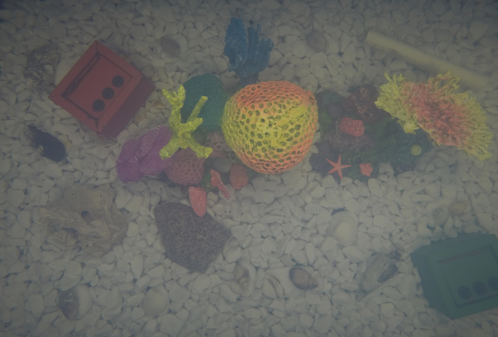
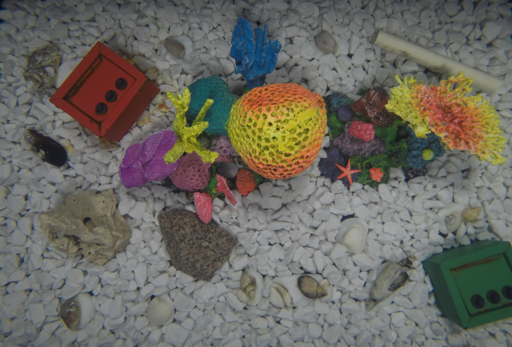

# Project
In this project, we implement a pipeline based on [this paper](https://groups.csail.mit.edu/graphics/xform_recipes/data/xform_paper_sigasia2015.pdf) that reduces the time and energy​ cost of uploading an image and downloading the output images after applying certain​ transformations.​

## Installation

- To install all the requirements, move to the home directory and run
```
pip install -r requirements.txt
```

- To run the code on a sample input and expected output image, go to `src` folder and run
```
bash run.sh <---path-to-input-image---> <---path-to-expected-output--->
```
## Results

Our code works well for transformations, where there is high correlation between input and output images. Few results are shown below:-

| Input Image | Expected Output | Our Output |
|----------|--------------------|--------|
|  | | |
|  |  |  |
|  |  |  |
