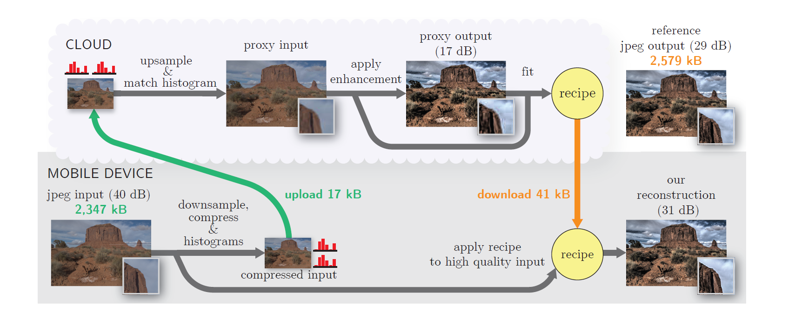
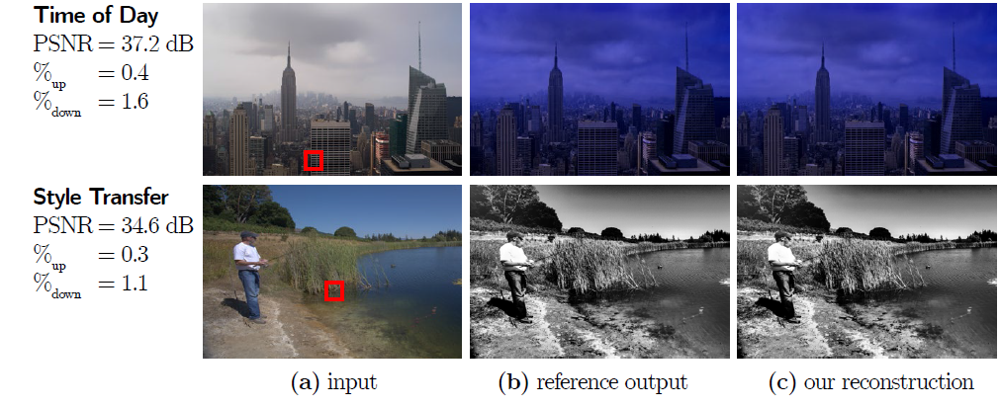

# Transform Recipes for Efficient Cloud Photo Enhancement  
## Project ID - 36  

Github link - [Here](https://github.com/Digital-Image-Processing-IIITH/project-hydrohomies)

### Team Members 
- Kalyan Adithya M
- Abhishek Reddy Gangapuram
- Jaiwanth Mandava
- Sai Shashank Kalakonda

### Main Goal(s):

- Main goal of the project is to implement a pipeline that reduces the time and energy cost of uploading the input and downloading the output images, while using remote compute resources to apply complex image transformations. 

### Problem Definition:
#### What is the problem?
+ > "Cloud computing is often thought as an ideal solution to enable complex algorithms on mobile devices; by exploiting remote resources, one expects to reduce running time and energy consumption. However, this ignores the cost of transferring data over the network, the overhead of which often negates the benefits of the cloud, especially for data-heavy image processing applications."[1]  
+ The paper[1] introduces a new image processing pipeline that reduces the amount of transmitted data.
#### How will it be done?
- Given an image, we generate a low-resolution jpeg-compressed version of the input image on the client. This is to reduce the cost of data-transfer from the client to the server. The server then computes a compact recipe that describes the image transformation. This compact recipe is downloaded by the client and later applied to the input image with minimum compute on the client-side.

- The pipeline is shown in the below image:-  

### Results
- We demonstrate the results on 168 different images and 10 applications. The paper[1] states that the transform recipe-based pipeline runs 2-4× faster and uses 2-7× less energy than local or naive cloud computation.
- Following are few expected results:-  

### Timeline

|Milestone | Expected Date of Completion |
|----------|-----------------------------|
| Recipe Computation | 23-10-2020 |
| Integrating recipe with input image| 26-10-2020 |
| Encoding Recipe for transfer | 29-10-2020 |
| Reconstructing output image at client side| 31-10-2020 | 
| Input image compression | 06-11-2020 |
| Upsampling the image at server side using histograms | 11-11-2020 |
| Benchmark on different images and applications | 16-11-2020 |

### Dataset

- Images are taken from MIT 5k dataset which can be found [here](https://data.csail.mit.edu/graphics/fivek/)

### References :-

[1] Transform Recipes for Efficient Cloud Photo Enhancement - https://groups.csail.mit.edu/graphics/xform_recipes/data/xform_paper_sigasia2015.pdf
